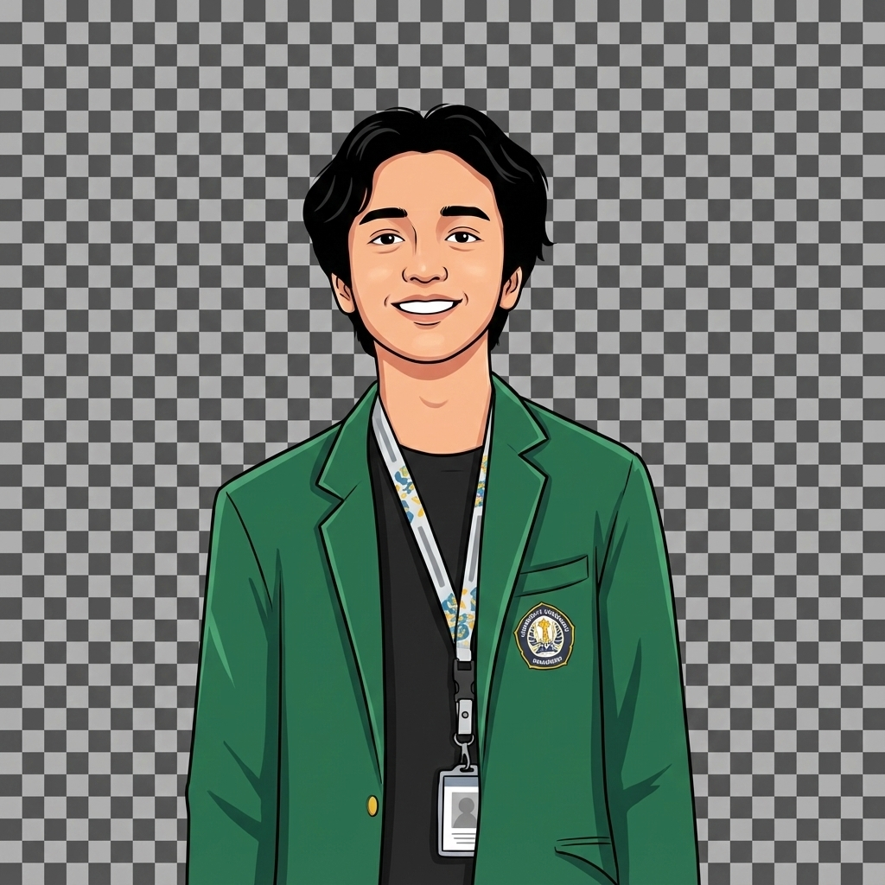

# Fauzan Hadi

**Semarang, Indonesia** · [fauzanhadi097@gmail.com](mailto:fauzanhadi097@gmail.com) · [LinkedIn](https://www.linkedin.com/in/fauzanhadii)

---

## 👤 About Me

Highly motivated Informatics student at **Diponegoro University** with a strong foundation in Full-stack Web Development and a specialized focus on Frontend Engineering. I excel at building responsive, high-performance web applications by combining technical precision with intuitive UI/UX design. Proficient in modern frameworks like **Next.js** and **React.js**, I am committed to bridging the gap between complex backend logic and seamless user interfaces.

- 🎓 **Bachelor of Science in Informatics** — Diponegoro University *(2023 – Present | GPA: 3.52/4.0)*
- 💼 Open to new opportunities as a Software Engineer & Frontend Developer
- 🌍 Based in Semarang, Indonesia

---

## 🛠️ Tech Stack

### Frontend Core

### Backend & Database

### Tools & Workflow

---

## 💼 Work & Internship Experience

| Period | Company | Role |
|---|---|---|
| Jan 2026 – Feb 2026 | **KJPP Anas Karim Rivai dan Rekan** | Software Engineer Internship |
| Dec 2025 – Feb 2026 | **ANSA Konveksi** | Frontend Developer Internship |
| Aug 2025 – Dec 2025 | **Asah led by Dicoding (MSIB)** | Full-stack Developer |
| Jul 2025 – Aug 2025 | **Mahkamah Agung RI** | Software Engineer Internship |
| Apr 2025 – May 2025 | **CV Asri 1188** | Frontend Developer Internship |

---

## 🚀 Featured Projects

| Project | Category | Tech Stack | Links |
|---|---|---|---|
| **KJPP Anas Karim Rivai & Rekan** | Corporate Website & Dashboard | Next.js, Tailwind CSS, Cloudinary | [Live](https://www.kjpp-akr.co.id/) · [Repo](https://github.com/FauzanHadi44/KjppAKR) |
| **ANSA Konveksi** | Company Profile | Next.js, Tailwind CSS, Vercel | [Live](https://www.ansakonveksi.com/) · [Repo](https://github.com/FauzanHadi44/pandawaKonveksii) |
| **CV ASRI 1188** | Company Profile | Next.js, TypeScript, Shadcn UI | [Live](https://asri1188.com) · [Repo](https://github.com/FauzanHadi44/CV-ASRI-1188) |
| **LOKALOKE** | SME Platform | React.js, Tailwind CSS, Framer Motion | [Live](https://lokaloke.vercel.app/) · [Repo](https://github.com/FauzanHadi44/LokalOKE) |
| **AI Learning Insight** | Capstone Project | React.js, Supabase, JavaScript | [Live](https://ai-learning-insight-dicoding.vercel.app/) · [Repo](https://github.com/Asah-AI-Learning-Insight/ai-learning-insight) |
| **Jualin Aja** | Academic Project | Laravel, MySQL, Tailwind CSS | [Repo](https://github.com/FauzanHadi44/JualinAja_PBP) |

---

## 📄 Resume / CV

📥 [**Download CV (PDF)**](public/Curriculum%20Vitae%20-%20Fauzan%20Hadi.pdf)

---

## 📊 GitHub Stats

---

## 📬 Contact

---

  Built with ❤️ using Next.js, TypeScript & Tailwind CSS

